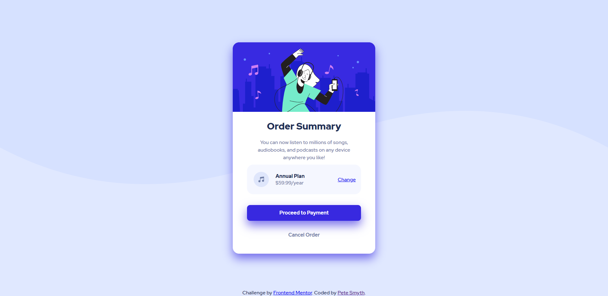

# Frontend Mentor - Order summary card solution

This is a solution to the [Order summary card challenge on Frontend Mentor](https://www.frontendmentor.io/challenges/order-summary-component-QlPmajDUj). Frontend Mentor challenges help you improve your coding skills by building realistic projects.

## Table of contents

- [Overview](#overview)
  - [The challenge](#the-challenge)
  - [Screenshot](#screenshot)
  - [Links](#links)
- [My process](#my-process)
  - [Built with](#built-with)
  - [What I learned](#what-i-learned)
  - [Issues](#issues)
  - [Continued development](#continued-development)
  - [Useful resources](#useful-resources)
- [Author](#author)
- [Acknowledgments](#acknowledgments)

**Note: Delete this note and update the table of contents based on what sections you keep.**

## Overview

### The challenge

Users should be able to:

- See hover states for interactive elements

### Screenshot



### Links

- Solution URL: [Add solution URL here](https://your-solution-url.com)
- Live Site URL: [My Front End Mentor - Order Summary component site](https://peterjsmyth.github.io/FEM_Order-Summary-Component/)

## My process

### Built with

- Semantic HTML5 markup
- CSS custom properties
- Flexbox

### What I learned

I used mixins in scss for the first time

```css
@mixin flex-column-center {
    display: flex;
    flex-direction: column;
    justify-content: center;
    align-items: center;
}

body {
    @include flex-column-center;
}
```
### Issues

There is a 5 pixel gap at the bottom of the Image in the card__hero section which I don't understand why it's there.

My use of vh sizes sees the content of the card overlap each other as the viewport height reduces. {Resolved: Removed VH sizes}

I don't understand why the footer moves off the bottom as the viewport height reduces to smaller than the card size as it is positioned absolutely at the bottom. {Resolved: Parent wasn't positioned}


### Continued development

Use this section to outline areas that you want to continue focusing on in future projects. These could be concepts you're still not completely comfortable with or techniques you found useful that you want to refine and perfect.

**Note: Delete this note and the content within this section and replace with your own plans for continued development.**

### Useful resources

- [Example resource 1](https://www.example.com) - This helped me for XYZ reason. I really liked this pattern and will use it going forward.
- [Example resource 2](https://www.example.com) - This is an amazing article which helped me finally understand XYZ. I'd recommend it to anyone still learning this concept.

**Note: Delete this note and replace the list above with resources that helped you during the challenge. These could come in handy for anyone viewing your solution or for yourself when you look back on this project in the future.**

## Author

- Website - [Pete Smyth](https://github.com/peterjsmyth)
- Frontend Mentor - [@peterjsmyth](https://www.frontendmentor.io/profile/peterjsmyth)


## Acknowledgments


